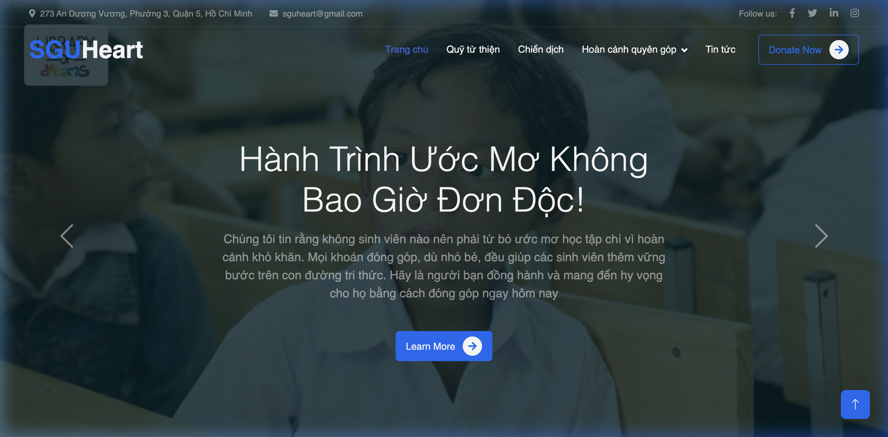
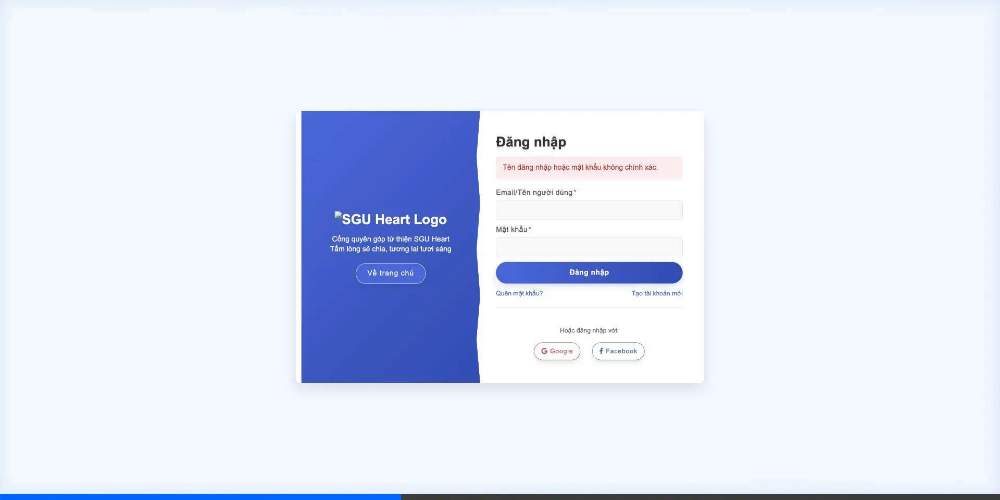
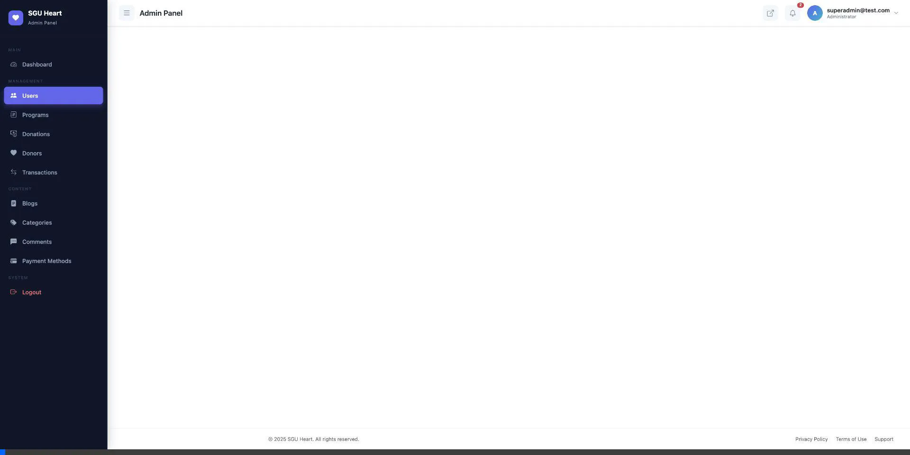

# 🌟 SGU Heart - Nền Tảng Gây Quỹ Tình Nguyện

**SGU Heart** là một ứng dụng web gây quỹ từ thiện toàn diện được phát triển bằng **Spring Boot 3**. Dự án kết nối các nhà hảo tâm với những chương trình thiện nguyện ý nghĩa, cung cấp trải nghiệm quyên góp an toàn, minh bạch và quản lý dễ dàng cho ban quản trị.

---

## 🎯 Các Tính Năng Nổi Bật

### 🧑‍💻 Dành Cho Người Dùng (Client)
- **Đăng ký & Đăng nhập bảo mật**: Hỗ trợ đăng nhập truyền thống (BCrypt) và đăng nhập nhanh qua tài khoản mạng xã hội (**Google**, **Facebook** OAuth2).
- **Duyệt & Tìm kiếm Chương trình**: Khám phá các chiến dịch gây quỹ theo danh mục, xem chi tiết tiến độ (số tiền mục tiêu vs thực tế).
- **Thanh toán Trực tuyến (VNPAY)**: Tích hợp cổng thanh toán VNPAY an toàn, hỗ trợ quét mã QR, thẻ ATM nội địa, thẻ quốc tế.
- **Tiến độ Thời gian Thực**: Thanh phần trăm (progress bar) tiến độ gây quỹ cập nhật tự động sau khi giao dịch thành công.
- **Quản lý Hồ sơ Cá nhân**: Cập nhật thông tin, thay đổi ảnh đại diện và theo dõi lịch sử quyên góp cá nhân (tải biên lai PDF).
- **Tin tức & Blog**: Theo dõi các bài viết cập nhật hoạt động tình nguyện với nội dung phong phú.

### 👑 Dành Cho Ban Quản Trị (Admin)
- **Dashboard Phân tích Tổng quan**:
  - Thống kê tự động: Tổng số tiền quyên góp, số lượt quyên góp, số chiến dịch, số người dùng.
  - Biểu đồ trực quan (Chart.js): Tỷ trọng theo Chương trình/Danh mục/Hình thức thanh toán, Top 5 nhà tài trợ, Tiến độ giải ngân chiến dịch, và Biểu đồ tăng trưởng người dùng mới.
- **Quản trị Toàn diện**:
  - Quản lý người dùng và phân quyền (Role-based access control).
  - Quản lý chiến dịch gây quỹ (Tạo mới, Sửa, Đóng chiến dịch).
  - Duyệt danh sách khoản đóng góp và giao dịch tài chính.
  - Đăng bài viết Tin tức (Blog).
- **Giao diện Quản trị Hiện đại**: Giao diện tối màu (Dark Theme), sang trọng, dễ nhìn, tốc độ máy chủ xử lý mượt mà.

---

## 📸 Hình Ảnh Dự Án (Screenshots)

### 1. Giao diện Trang chủ (Client Homepage)
Giao diện sáng sủa, các nút kêu gọi hành động (Call To Action) rõ ràng, hiển thị các chương trình nổi bật.



### 2. Chi tiết Chương trình & Tin Tức
Hiển thị đầy đủ thông tin, thanh tiến độ quyên góp, và các chiến dịch liên quan. Hỗ trợ hiển thị nội dung Blog phong phú.


### 3. Tích hợp Thanh toán VNPAY (Quyên góp)
Hỗ trợ thanh toán nhanh chóng, an toàn thông qua cổng VNPAY Sandbox trực tiếp trên nền tảng với đầy đủ mã giao dịch.


### 4. Bảng điều khiển Quản trị (Admin Dashboard)
Thống kê toàn bộ dữ liệu hệ thống bằng con số và các dạng biểu đồ chuyên nghiệp (Pie Chart, Doughnut Chart, Bar Chart, Line Chart).



### 5. Quản lý Đa năng dành cho Admin (Management Interfaces)
Quản trị viên có thể theo dõi danh sách Người Dùng, thay đổi trạng thái Chiến Dịch, quản lý Quyên Góp trực tiếp với giao diện lưới (Data Table) tiện lợi, cho phép Tìm kiếm (Search) và Sắp xếp (Sort) linh hoạt.



---

## ⚙️ Công Nghệ Sử Dụng (Tech Stack)

### Backend
- **Java 21**
- **Spring Boot 3** (Spring Web, Spring Data JPA, Spring Security)
- **Hibernate / JPA**
- **Thymeleaf** (Template Engine rendering HTML trực tiếp từ server)
- **OAuth2 Client** (Xác thực Google/Facebook)
- **Cổng thanh toán:** API VNPAY
- **Cơ sở dữ liệu:** MySQL 8

### Frontend
- **HTML5, CSS3, JavaScript (Vanilla)**
- **Bootstrap 5** (Responsive UI/UX)
- **Chart.js** (Khởi tạo biểu đồ cho Admin Dashboard)

### Triển Khai (Deployment) & Công Cụ
- **Docker & Docker Compose**: Ứng dụng và cơ sở dữ liệu (MySQL) được đóng gói sẵn trong Container, chỉ cần chạy qua lệnh `docker compose up`.
- **Git / GitHub**

---

## 🚀 Hướng Dẫn Cài Đặt (Local Setup)

Dự án đã được build sẵn với Docker, vô cùng dễ cài đặt.

### Điều kiện tiên quyết
- Đã cài đặt [Docker Desktop](https://www.docker.com/products/docker-desktop).

### Các bước chạy
1.  **Clone mã nguồn dự án:**
    ```bash
    git clone https://github.com/thanhtrongvo/SpringDonateWeb.git
    cd SpringDonateWeb
    ```

2.  **Khởi chạy với Docker Compose:**
    ```bash
    docker compose up -d --build
    ```
    Hệ thống sẽ tự động tải MySQL 8.0, build file `.jar` của Spring Boot (Java 21) và liên kết 2 container lại với nhau.

3.  **Truy cập ứng dụng:**
    - Cổng người dùng (Client): `http://localhost:8080/`
    - Cổng quản trị (Admin): `http://localhost:8080/admin/index`
        - *Tài khoản Admin mặc định:* `admin@sguheart.com`
        - *Mật khẩu:* `password123`


---

